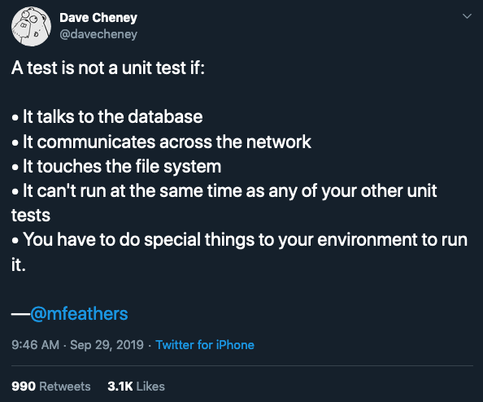

# go-learn-demo

## Debug

[x] vs code

## Test

- unit test
  - [x] method mock `go test -tags mock`。 `+build mock / !mock` 见 `user model`
  - [https://deployeveryday.com/2019/10/08/golang-auth-mock.html](https://deployeveryday.com/2019/10/08/golang-auth-mock.html)
- integrated test
  - io mock
    - [x] http mock [https://www.ru-rocker.com/2017/07/10/how-to-unit-test-and-mocking-a-function-in-go/](https://www.ru-rocker.com/2017/07/10/how-to-unit-test-and-mocking-a-function-in-go/)
    
## custom error
[https://itnext.io/golang-error-handling-best-practice-a36f47b0b94c](https://itnext.io/golang-error-handling-best-practice-a36f47b0b94c)

## middleware